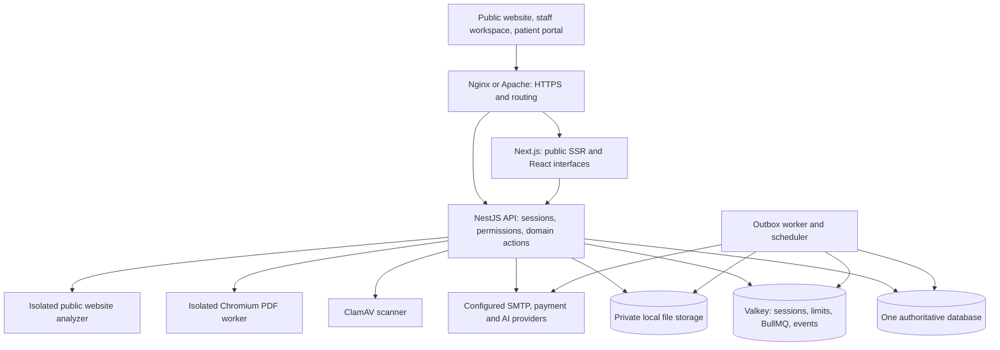

<!-- Author: ramanpal singh | URL: https://kwebby.com -->
# ClinicsCMS architecture and extension guide

ClinicsCMS is a TypeScript modular monolith deployed once per clinic or clinic group. The repository contains the website/workspace, authoritative API, background workers and database adapters. Each installation selects one database. Branches share that installation's organization, permissions and configuration; this is not a hosted multi-tenant billing/control-plane service.

For runnable commands use [installation](INSTALLATION.md), [dependencies](DEPENDENCIES.md) and [deployment](../deploy/README.md). The [implementation status](IMPLEMENTATION-STATUS.md) distinguishes implemented behavior from release gates that remain unverified. The presence of an adapter or container profile does not establish production certification.

## Components and trust boundaries

The diagram describes responsibilities, not a complete firewall policy. Follow the actual deployment profiles for network membership and mounts. Web code receives public projections or an authenticated session view, never database or provider credentials. API/domain methods resolve the actor on the server; a client-supplied role, branch or patient ID does not grant authority. Database access is restricted to API and authorized workers/tooling.

Public content is server-rendered. Interactive React editors load in authenticated routes. Next's internal API rewrite is for local/application routing; the production proxy configuration defines external API and WebSocket routing. `PUBLIC_URL` supplies the public origin used for canonical links and origin checks. Do not expose internal ports or assume an arbitrary forwarded header is trustworthy.

## Repository map

| Directory/file | Responsibility |
|---|---|
| `apps/api/src/main.ts` | Nest startup, security headers, CORS, rate limiting, safe errors, optional OpenAPI |
| `apps/api/src/auth.ts` | Registration, verification, invitations, sessions, MFA and patient-account identity links |
| `apps/api/src/controllers.ts` | Versioned HTTP routes, public projections and authenticated operations |
| `apps/api/src/gateway.ts` | Authenticated Socket.IO chat/notification delivery |
| `apps/api/src/security.ts` | Secret encryption, origin checks and rate-limiting helpers |
| `apps/api/src/integrations.ts` | SMTP, payment providers, checkout/webhooks and reconciliation boundaries |
| `apps/api/src/runtime.ts` | Constructs the selected persistence, authorization, storage and service dependencies |
| `apps/web/app` | Next.js routes: public website, account pages, staff workspace and portal |
| `apps/web/components` | Shared UI, BlockNote editor, records, calendar/Kanban, theme and website editors |
| `apps/web/lib` | Browser API client, route/field metadata, date handling, draft memory and public SSR utilities |
| `apps/web/proxy.ts` | Response security/CSP and private-route behavior |
| `apps/worker/src/main.ts` | Outbox polling, BullMQ consumers, lifecycle and maintenance guards |
| `apps/worker/src/processor.ts` | Idempotent event processing, notifications, delivery and retry states |
| `apps/worker/src/scheduler.ts` | Appointment reminders, task deadlines and result follow-up scheduling |
| `packages/contracts/src/index.ts` | Actor, roles, entity/version, repository/transaction and shared error contracts |
| `packages/contracts/src/website.ts` | Browser-safe, strict website settings, sections, branding and location contracts |
| `packages/core/src/schemas.ts` | Strict domain input and settings validation |
| `packages/core/src/access.ts` | Role, organization, branch, ownership and linked-patient rules |
| `packages/core/src/service.ts` | Clinical/business actions, atomic state transitions, audit and outbox writes |
| `packages/persistence/src` | PostgreSQL/MySQL/Supabase, Firestore, test memory adapter and portable transfer |
| `packages/platform/src/content.ts` | Versioned BlockNote structure and safe content rendering |
| `packages/platform/src/themes.ts` | ZIP validation, immutable theme assets, publication snapshots and rollback |
| `packages/platform/src/seo.ts` | Metadata, schemas, canonical links, translations and sitemap generation |
| `packages/platform/src/files.ts` | Private file storage, content signatures, malware scanning and access checks |
| `packages/platform/src/public-assets.ts` | Explicit public media uploads with image re-encoding and asset references |
| `packages/platform/src/ai.ts` | Reviewed AI/transcription drafts, provider policy and usage/provenance |
| `packages/platform/src/tools.ts` | Bounded patient/vendor lead tools |
| `packages/platform/src/pdf*.ts` | Trusted financial document rendering and isolated PDF process |
| `packages/platform/src/analyzer-worker.ts` | Bounded public-site retrieval with network-address validation |
| `scripts` | Setup, bootstrap, migration/transfer, certification, font sync and theme packaging |
| `deploy` | Pinned containers, proxy profiles, initialization and operational scripts |
| `tests` | Domain, HTTP/auth, persistence, worker/security, utility and browser tests |
| `examples/themes` | Valid portable theme examples, kept separate from clinic content |

The `packages/` directories are shared source compiled from the root TypeScript project, not independently published npm packages. Node-facing imports use ESM and `.js` specifiers for emitted files. The web app has a separate Next.js build and its own package. Preserve existing import conventions when adding modules.

## Persistence model

Every entity has `id`, `organizationId`, `version`, `createdAt` and `updatedAt`. Domain-specific fields sit alongside them. The repository interface provides `get`, `list`, `put` and `remove`; the database adds initialization, shutdown and `transaction(lockKeys, callback)`.

| Selection | Current implementation |
|---|---|
| `postgres` | Kysely + `pg`; JSONB entity payloads |
| `mysql` | Kysely + `mysql2`; JSON entity payloads |
| `supabase` | The PostgreSQL implementation pointed at a Supabase PostgreSQL connection |
| `firestore` | Firebase Admin SDK and a dedicated Firestore adapter |
| `memory` | Available only when `NODE_ENV=test` |

The SQL adapter currently uses a generic `clinic_records` table keyed by collection and ID, plus `clinic_locks` for transaction guards. It does not have a normalized table per clinical module. Scalar projections support bounded equality queries and ID-based pagination. As clinic data grows, measure query behavior and add intentional indexes/projections instead of promising unlimited scale from this initial schema.

Firestore uses `clinic_`-prefixed collections. It stores canonical JSON in `_payload` to preserve nested BlockNote arrays and scalar projections for queries. The adapter stages writes so all transaction reads precede writes, and caps pending writes plus guard records at 450. Do not add a domain operation that silently exceeds that cap. Real Firestore index, contention, cost and recovery tests remain separate from emulator or in-memory tests.

Writes use expected versions to reject stale edits. SQL transactions obtain sorted lock records and retry selected deadlock/serialization failures. Firestore uses transactional guard documents and its retry mechanism. Transaction callbacks may be retried: keep external effects, emails, provider calls and non-idempotent operations outside those callbacks. Use deterministic business IDs/keys where an operation must be deduplicated.

Database switching is a maintenance-window export/import with integrity checks, not changing `DATABASE_DRIVER` while requests are running. Keep the file store paired with records. See [data transfer](DATA-TRANSFER.md).

## Request and state flow

The HTTP prefix is `/api/v1`. Successful API responses generally have `{ "data": ... }`; failures use a safe error code/message and request ID. Authenticated mutations use the opaque session cookie, `X-CSRF-Token` and origin checks. Read the [API contract](API-CONTRACT.md) and [domain actions](DOMAIN-API.md) for actual request schemas.

The normal path for a domain mutation is:

1. Authenticate and resolve a server-owned `Actor`.
2. Validate a strict bounded input schema.
3. Load the target and verify organization, role, branch and ownership/link scope.
4. Start the required transaction and verify expected versions and state preconditions.
5. Write the new entity state, audit record and durable outbox event together.
6. Return committed state. Process external work after commit.

Appointment, encounter, result, invoice, payment, task and payroll states are separate. For example, a paid invoice does not sign an encounter or release a clinical result. Shared-family phone/email data is not sufficient to merge identities or grant access. Signed clinical narratives freeze their content; amendments create new traceable records. Financial documents keep immutable business-data/template snapshots; template changes cannot recalculate an issued amount.

UI visibility is a convenience, not authorization. Add server checks for table status shortcuts, drag/drop transitions, file downloads, WebSocket events and worker delivery just as for a full edit page. A route that bypasses `ClinicService` needs equally explicit validation and access rules.

## Durable events, queues and providers

The main database's `outbox` collection is the durable source of pending business work. BullMQ/Valkey supplies delivery coordination; it is not the only copy of an issued-invoice or notification obligation. The worker polls eligible pending events and expired processing leases. It records attempts/status, uses event-specific idempotency, and applies current recipient authorization before delivery.

`OUTBOUND_WORKERS_ENABLED` gates consumption and scheduled work. Keep it disabled during recovery and reconciliation. Startup rejects maintenance/incomplete-restore markers. Unknown event types fail visibly until a handler is installed; do not mark them successful by default.

SMTP acceptance and confirmed delivery are distinct. Ambiguous acceptance is retained for review to avoid blind duplicate sends. Payment checkout returns do not decide settlement: verified, deduplicated provider webhooks and reconciliation update financial state. AI outputs are drafts with model/prompt provenance and configured data-use limits, and cannot sign or release clinical content.

Provider implementations belong server-side. A new provider needs configuration validation, encryption for stored credentials, idempotency and signature handling, timeouts, bounded retries, safe logs and a clear missing-configuration error. Never return pretend success when a provider is absent.

## Files and isolated processing

The private storage root is outside the webroot. File records bind organization, scope, owner and any patient/conversation/payroll association. Reads recheck authorization and content hash. Never serve the entire root through Nginx/Apache static aliases.

Public marketing images use a separate, explicit upload service. It requires permitted staff, descriptions, scanning and safe raster re-encoding. There is no operation that turns an existing patient file into a public image. Theme uploads follow their own ZIP/data-only rules. Consult [theme development](THEME-DEVELOPMENT.md) for the exact boundary and current limitations.

Financial PDFs are rendered from trusted primitives in Chromium with scripts and network access disabled. The analyzer performs bounded public fetches with SSRF checks and must run with the documented production egress restrictions. Container/configuration presence is not proof that isolation is effective: validate it on the deployed host.

## Content, themes and public discovery

Canonical writing content is versioned BlockNote JSON. Browser editing and server rendering must agree on supported application-owned blocks and preserve round trips. Public medical content can include citations/review information. Signed clinical content additionally freezes the rendering version; do not retrospectively reinterpret it after changing a block renderer.

Public content has two layers:

- CMS pages keep drafts, approved snapshots and revision history. Slug publishing manages page routes/redirects.
- A website publication binds a validated theme to selected public settings and approved page snapshots. Homepage/branding settings override the portable theme as described in the [theme guide](THEME-DEVELOPMENT.md).

Canonical branch records supply public name/address/phone/hours, location pages and MedicalClinic structured data. Website identity is distinct from invoice/legal identity. SEO/social metadata is generated independently of themes. Private routes and personalized tool results remain excluded from public indexing and sitemaps. Adding JSON-LD is not proof of ranking or rich-result eligibility.

## Add a module without weakening the boundaries

1. Define the state model and bounded fields in contracts/schemas. Decide the separate permissions for view, create, change status, approve/sign, release, export and amend.
2. Add collection handling, actor-visible projections and state transitions in core. Use appropriate transaction keys and optimistic versions. Add audit/outbox records where the change has business effects.
3. Add API routes only for behavior not already represented by the generic records/actions interface. Document the request/response and OpenAPI behavior. Keep sensitive fields out of generic or public projections.
4. Add provider/worker code for external effects, including restart/idempotency tests and failure states.
5. Add workspace metadata/forms and dedicated routes. Preserve draft recovery, accessible table actions and keyboard interaction. Use calendar/Kanban only when the domain has meaningful dates/states.
6. Run the same domain/adapter contract for every supported database. Test unauthorized and stale-version paths as well as success. Use Playwright for the actual workflow, not only isolated widgets.
7. Document installation/configuration, maintenance, upgrade, rollback and limitations. Update release gates for new external dependencies or clinical/financial risks.

For a custom website block, follow the more specific checklist in [theme development](THEME-DEVELOPMENT.md). Do not widen JSON schemas to arbitrary content simply to avoid designing the data model.

## Verification and release boundaries

Use the root scripts for TypeScript, unit/contract tests and production builds. Playwright needs a running API/web app and isolated fictional accounts; database certification needs disposable instances and explicit environment configuration. Existing checked-in verification reports describe particular runs, not a promise that every machine/backend/provider has passed.

Before a real-data pilot, complete [release gates](security/RELEASE-GATES.md), including the requested database/deployment matrix, provider flows, clean-host restore, measured recovery target, clinical/localization approval and independent penetration test. Keep the implementation's evidence and the outstanding gates visible when publishing releases.
